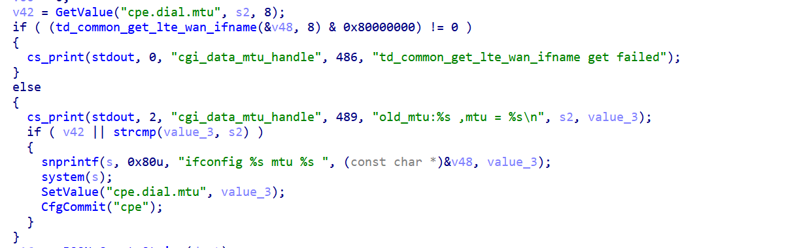

## httpd `mtu` 命令注入（远程 RCE）

| 字段            | 内容                                                         |
| --------------- | ------------------------------------------------------------ |
| 漏洞类型 CWE    | CWE-78（OS 命令注入）                                        |
| 受影响组件      | `httpd`（GoAhead web 服务），函数 `cgi_add_profile`（0x41f19c） |
| 攻击类型 / 向量 | 远程；HTTP JSON API `POST /goform/setModules`，字段 `simWan.mtu` |
| 前置条件        | 需登录管理员（Basic 认证 / Cookie）                          |
| CVSS 3.1        | AV:N/AC:L/PR:H/UI:N/S:U/C:H/I:H/A:H = **7.2**                |

**描述：**
Tenda 5G03（固件 V05.03.01.26，硬件 V1.1）的 httpd 服务在处理 `setModules` 的 `simWan` 模块时，`cgi_add_profile` 函数将 JSON 中的 `mtu` 字段未经任何数字/字符校验，直接拼接进 `ifconfig <ifname> mtu <mtu>` 字符串后交给 `system()` 执行。攻击者登录管理后台后，可将 `mtu` 设为 `1500; <任意命令>;` 实现以 root 权限执行任意系统命令，完全控制设备。

- 注入点：`mtu` 字段（`cjson_get_value(json,"mtu","1500")`，无校验）
- Sink：`system("ifconfig %s mtu %s", ifname, mtu)` @ 0x41f4e4
- 相邻字段均做了校验，唯独 `mtu` 漏了。

